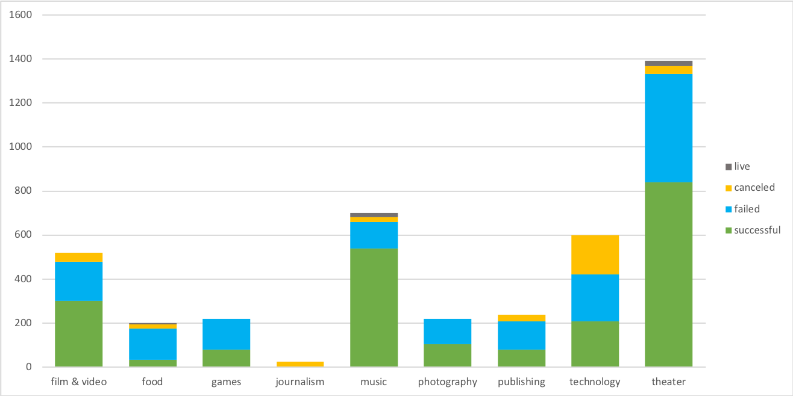
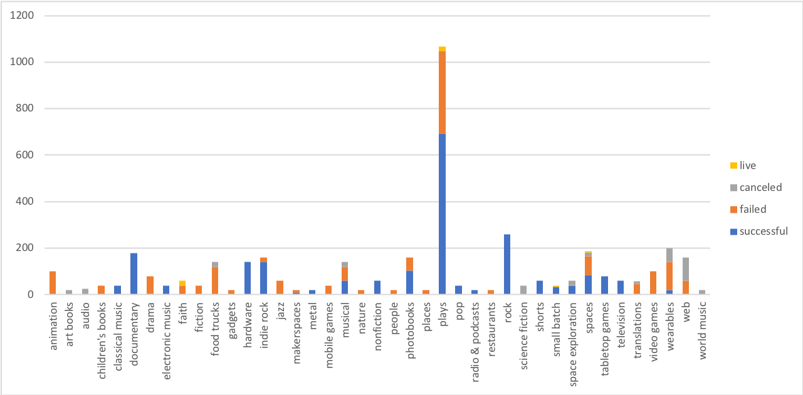
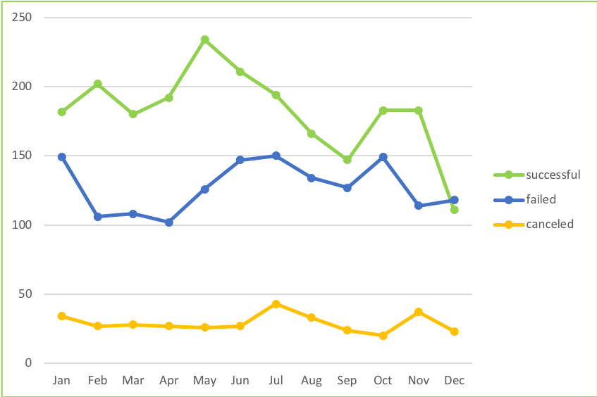

# StarterBook

## Background

Over two billion dollars have been raised using the massively successful crowdfunding service, Kickstarter, but not every project has found success. Of the over 300,000 projects launched on Kickstarter, only a third have made it through the funding process with a positive outcome.

Since getting funded on Kickstarter requires meeting or exceeding the project's initial goal, many organizations spend months looking through past projects in an attempt to discover some trick to finding success.

## Objectives

This is an Excel Analysis of four thousand past Kickstarter projects to uncover hidden trends by examining the funding process and success rate.

### Three conclusions:

After doing the above instructions, I got three pivot tables and charts. We can easily find out theater and music are the two most successful categories in Kickstarter campaigns. We can recognize plays and rock are the most successful topics under the theater and music categories. In addition, Kickstarter campaigns started on May seems to be the most successful. There are more Kickstarter campaigns would be canceled on July. According to Outcomes Based on Goal Line Chart, higher goal doesn’t lead to higher success.

### Some of the limitations of this dataset:
One limitation of this dataset is population. We don’t know how many total people are involved from each country. Maybe some small counties have less population, but more people are involved to pledge. Another limitation is the different exchange rate of currency. Because of different exchange rate, a large amount of pledges doesn’t necessarily mean more money. Maybe science fiction shows start in the morning, so less people are able to watch. That is why it failed.

### Considerations:
We can create exchange rate columns. It will exchange the amount of goal from different currencies to be the same. That will be help us judge the amount of pledges. We can also make a bar chart to compare different categories in the same month. It can help us understand which month what types of Kickstarter campaigns are more popular and successful.
